# Proyecto de analítica de datos y modelo predictivo sobre cambio climático

Análisis integral del sistema ENSO (El Niño / La Niña) entre 1950 y 2026, aplicando
un flujo ETL → EDA → dashboard de BI → modelos predictivos supervisados.

---

## Dataset

- **Nombre:** `Cambio_climatico.csv`
- **Fuente:** Registro histórico de anomalías del Pacífico ecuatorial (ENSO)
- **Registros:** 918 registros mensuales (1950–2026), 914 tras limpieza
- **Variables:** 17 columnas tras transformación (temperatura, anomalías, fase, intensidad, duración, variables derivadas)

## Diccionario de variables

| Campo | Descripción | Unidad |
|---|---|---|
| `Fecha` | Fecha mensual del registro | YYYY-MM-DD |
| `Anio` | Año del registro | YYYY |
| `Mes` | Mes del registro (1–12) | Número |
| `Trimestre` | Trimestre del año (1–4) | Número |
| `Decada` | Década del registro (1950s–2020s) | Texto |
| `Temperatura_Pacifico_C` | Temperatura superficial del Pacífico ecuatorial | °C |
| `Temperatura_Ajustada_C` | Temperatura ajustada a línea base histórica | °C |
| `Anomalia_C` | Desviación respecto a la media histórica | °C |
| `Anomalia_Trimestral_C` | Promedio trimestral de la anomalía | °C |
| `Anomalia_12m` | Promedio móvil de 12 meses de la anomalía | °C |
| `Anomalia_Delta` | Cambio mensual de la anomalía | °C |
| `Fase_Evento` | Clasificación: El Niño / La Niña / Neutral | Texto |
| `Intensidad_Evento` | Débil / Moderado / Fuerte / Muy fuerte / Neutral | Texto |
| `Duracion_Meses` | Duración acumulada del evento activo | Meses |
| `Evento_Extremo` | Indicador binario: 1 si \|Anomalia_C\| > 1.5°C | 0/1 |

---

## Integrantes - Grupo 5

| Nombre | Fase principal | GitHub |
|---|---|---|
| Ziuvar Ruiz | Fases 1 y 2 | `@ziuvar` |
| Vanessa Alfaro | Fase 3 | `@valexq` |
| Juan Manuel Valencia | Fases 4 y 5 | `@Juanchos2905` |
| Juan Cardona | Fases 4 y 5 | `@jcardser` |

---

# Descripción del proyecto

El dataset contiene 914 registros mensuales del sistema ENSO entre 1950 y 2026,
con variables como temperatura del Pacífico, anomalía térmica, fase del evento,
intensidad y duración. A partir de ellos se construyó una solución analítica que
cubre limpieza de datos, análisis exploratorio, modelo de BI y modelado predictivo.

---

# Objetivos

Desarrollar un proyecto integral sobre el sistema ENSO con énfasis en su impacto
en Colombia, cubriendo:

- Datos limpios y transformados listos para análisis.
- Dashboard de BI con KPIs e insights sobre el ciclo ENSO.
- Modelos supervisados evaluados con métricas de desempeño.
- Conclusiones y recomendaciones basadas en evidencia.

---

# Tecnologías utilizadas

| Componente | Tecnología |
|---|---|
| Lenguaje | Python 3.11 |
| Manipulación de datos | pandas, numpy |
| Visualización | matplotlib, seaborn |
| Machine Learning | scikit-learn |
| Notebooks | Jupyter Notebook |
| Persistencia | CSV |

---

# Arquitectura del proyecto

```text
Final_Project_DataAnalysis/
│
├── data/
│   ├── raw/
│   │   └── Cambio_climatico.csv                  # Dataset crudo ENSO (918 registros)
│   └── processed/
│       ├── enso_cleaned.csv                      # ENSO limpio (914 filas, 11 cols)
│       └── enso_model_ready.csv                  # ENSO con variables derivadas (914, 17)
│
├── notebooks/
│   ├── 01_etl.ipynb                              # ETL: limpieza y transformación
│   ├── 02_eda.ipynb                              # EDA: análisis exploratorio
│   ├── 03_modelado_predictivo_clima.ipynb        # Regresión: predicción Anomalia_C
│   ├── 04_modelo_bi.ipynb                        # BI: esquema estrella, KPIs, insights
│   └── 05_clasificacion_evento_extremo.ipynb     # Clasificación: predicción Evento_Extremo
│
├── reports/
│   ├── bi_enso_dashboard.png
│   ├── comparacion_modelos.png
│   ├── clasificacion_evento_extremo.png
│   ├── importancia_variables.png
│   ├── importancia_clasificacion.png
│   ├── pred_vs_real.png
│   └── guion_presentacion.md
│
├── requirements.txt
└── README.md
```

---

# Fase 1 — ETL: extracción, transformación y carga

Se trabajó con el archivo crudo `data/raw/Cambio_climatico.csv`, que contiene
918 registros mensuales de temperaturas y anomalías del Pacífico ecuatorial entre
1950 y 2026.

El trabajo de esta fase se concentró en dejar una base confiable para el análisis.
Se renombraron columnas al español, se mapearon las fases al idioma del proyecto,
se eliminaron 4 registros nulos y se construyeron 6 variables derivadas clave.

| Variable derivada | Descripción |
|---|---|
| `Decada` | Década del registro (1950s, 1960s…) |
| `Intensidad_Evento` | Clasificación por magnitud de anomalía |
| `Duracion_Meses` | Meses consecutivos del evento activo |
| `Evento_Extremo` | 1 si \|Anomalia_C\| > 1.5°C |
| `Anomalia_12m` | Promedio móvil de 12 meses |
| `Anomalia_Delta` | Cambio mensual de la anomalía |

**Resultado:** `enso_cleaned.csv` (914 filas, 11 columnas) y
`enso_model_ready.csv` (914 filas, 17 columnas).

---

# Fase 2 — EDA: análisis exploratorio de datos

Se tomó el dataset procesado y se realizó una exploración en 12 secciones para
entender el comportamiento del sistema ENSO. Se revisaron distribuciones,
comparaciones por fase, tendencias por década y el impacto en Colombia.

### Hallazgos principales del EDA

1. Los eventos de El Niño se han **intensificado desde la década de 1980**, con
   mayor frecuencia de anomalías superiores a +1.5°C.
2. Colombia se ve afectada en años de El Niño fuerte (1982–83, 1997–98, 2015–16)
   con sequías, y en años de La Niña intensa (1999–2000, 2010–11) con inundaciones.
3. La duración promedio de los eventos ha aumentado en las últimas dos décadas,
   lo que implica mayor exposición sostenida a condiciones extremas.
4. La correlación entre `Anomalia_C` y `Temperatura_Pacifico_C` es muy alta
   (r > 0.95), confirmando que la temperatura superficial es el indicador central.

---

# Fase 3 — Inteligencia de negocios: modelo de datos y KPIs

El notebook `04_modelo_bi.ipynb` documenta el modelo de BI sobre el dataset ENSO:
esquema estrella, cálculo de KPIs ejecutivos e insights para el dashboard.

## Modelo dimensional — Esquema Estrella

```mermaid
erDiagram
    FACT_ENSO {
        int id_tiempo FK
        int id_fase FK
        float Temperatura_Pacifico_C
        float Temperatura_Ajustada_C
        float Anomalia_C
        int   Duracion_Meses
        int   Evento_Extremo
    }

    DIM_TIEMPO {
        int    id_tiempo PK
        string Fecha
        int    Anio
        int    Mes
        int    Trimestre
        string Decada
    }

    DIM_FASE {
        int    id_fase PK
        string Fase_Evento
        string Intensidad_Evento
    }

    DIM_TIEMPO ||--o{ FACT_ENSO : "pertenece a"
    DIM_FASE   ||--o{ FACT_ENSO : "clasifica"
```



## Descripción del modelo

| Tabla | Tipo | Filas | Descripción |
|---|---|---|---|
| `FACT_ENSO` | Hechos | 914 | 1 registro mensual con todas las métricas |
| `DIM_TIEMPO` | Dimensión | 914 | Fecha, Año, Mes, Trimestre, Década |
| `DIM_FASE` | Dimensión | 5 | Fase del evento + Intensidad |

## Reglas de negocio

| Regla | Descripción |
|---|---|
| RN-01 | 1 registro mensual por fecha (sin duplicados) |
| RN-02 | `Anomalia_C` = temperatura observada menos media histórica (°C) |
| RN-03 | `Evento_Extremo` = 1 si \|Anomalia_C\| > 1.5°C |
| RN-04 | `Fase_Evento` clasificada en: El Niño, La Niña, Neutral |
| RN-05 | `Duracion_Meses` = meses consecutivos del evento activo |
| RN-06 | Período de análisis: 1950–2026 (914 registros mensuales) |
| RN-07 | `Anomalia_C` es la métrica principal del sistema ENSO |

## KPIs ejecutivos

| KPI | Valor |
|---|---|
| Anomalía promedio global | 0.026 °C |
| Anomalía máxima histórica | +2.77 °C |
| Anomalía mínima histórica | -2.09 °C |
| Eventos extremos totales | 82 (8.97% de registros) |
| Década más activa | 1990s |
| Evento más largo | 50 meses |

## Insights del dashboard

**Insight 1 — Tendencia de intensificación:** los eventos extremos se concentran
en las décadas 1980s, 1990s y 2010s. El Niño 1997-98 es el más intenso del período.

**Insight 2 — Fase Neutral predomina:** el 44% de los meses son Neutral, 31% La Niña
y 25% El Niño. La irregularidad del ciclo es estructural, no aleatoria.

**Insight 3 — Duración como indicador de impacto:** los eventos más largos (>30 meses)
coinciden con los de mayor anomalía y mayor número de extremos.

**Insight 4 — Colombia como región de alta exposición:** los años de impacto severo
en Colombia coinciden exactamente con los picos de anomalía positiva y negativa.

---

# Fase 4 — Modelado predictivo: regresión (Anomalia_C)

El notebook `03_modelado_predictivo_clima.ipynb` predice la **anomalía de temperatura**
del Pacífico a partir de variables temporales y de fase climática.

## Fuente de datos

- Dataset: `data/processed/enso_model_ready.csv` (914 registros)
- Variable objetivo: `Anomalia_C` (regresión continua)
- División: 80% entrenamiento (731) / 20% prueba (183)

## Variables del modelo

**Numéricas:** `Anio`, `Mes`, `Trimestre`, `Temperatura_Pacifico_C`,
`Temperatura_Ajustada_C`, `Anomalia_12m`, `Anomalia_Delta`, `Duracion_Meses`

**Categóricas:** `Decada`, `Fase_Evento`, `Intensidad_Evento`

**Excluidas:** variables derivadas directamente del target
(`Anomalia_Trimestral_C`, `Fase_Trimestral`, `Evento_Extremo`) y `Fecha`.

## Evaluación de modelos

| Modelo | RMSE | MAE | R² |
|---|---|---|---|
| Regresión Lineal | 0.0042 | 0.0026 | 1.0000 |
| Árbol de Decisión | 0.1936 | 0.1529 | 0.9496 |
| Random Forest | 0.1148 | 0.0876 | 0.9823 |
| **Gradient Boosting** | **0.0927** | **0.0725** | **0.9885** |

> La Regresión Lineal alcanza R²=1.0 porque `Anomalia_12m` (promedio móvil de 12 meses)
> tiene una relación casi lineal con el target. Es un resultado estadístico esperado, no sobreajuste.

## Validación cruzada (Gradient Boosting — 5 folds)

| R² promedio | Desviación estándar |
|---|---|
| 0.968 | ± 0.013 |

## Importancia de variables (Random Forest)

| Variable | Importancia |
|---|---|
| `Fase_Evento_El Nino` | 54.4% |
| `Intensidad_Evento_Debil` | 11.6% |
| `Fase_Evento_La Nina` | 9.3% |
| `Temperatura_Pacifico_C` | 5.3% |
| `Anomalia_12m` | 2.4% |

## Conclusiones

1. **Gradient Boosting** es el mejor modelo con R²=0.9885 y RMSE=0.09°C.
2. La fase ENSO explica el 54% de la varianza — es el motor principal del sistema.
3. La validación cruzada confirma R²=0.968 ± 0.013: el modelo generaliza correctamente.
4. El modelo puede usarse como base para alertas tempranas en Colombia.

---

# Fase 5 — Modelado predictivo: clasificación (Evento_Extremo)

El notebook `05_clasificacion_evento_extremo.ipynb` predice si un mes registrará
un **evento climático extremo** (`Evento_Extremo = 1`) usando solo variables
temporales e independientes — sin temperatura ni anomalía directa.

## Fuente de datos

- Dataset: `data/processed/enso_model_ready.csv` (914 registros)
- Variable objetivo: `Evento_Extremo` (clasificación binaria)
- División: 80% / 20% con `stratify=y` para mantener balance de clases

## Variables del modelo

**Numéricas:** `Anio`, `Mes`, `Trimestre`, `Duracion_Meses`

**Categóricas:** `Decada`, `Fase_Evento`

**Excluidas deliberadamente:** `Anomalia_C`, `Intensidad_Evento`,
`Temperatura_Pacifico_C` (derivadas del target o predicen trivialmente).

## Evaluación de modelos

| Modelo | Accuracy | Precision | Recall | F1 | AUC-ROC |
|---|---|---|---|---|---|
| Regresión Logística | 0.7158 | 0.2188 | 0.8750 | 0.3500 | 0.8312 |
| Árbol de Decisión | 0.8415 | 0.3415 | 0.8750 | 0.4912 | 0.8808 |
| **Random Forest** | **0.9508** | **0.8182** | **0.5625** | **0.6667** | **0.9308** |
| Gradient Boosting | 0.9399 | 0.6667 | 0.6250 | 0.6452 | 0.9203 |

## Validación cruzada (Random Forest — 5 folds)

| F1 promedio | Desviación estándar |
|---|---|
| 0.386 | ± 0.138 |

## Importancia de variables (Random Forest)

| Variable | Importancia |
|---|---|
| `Duracion_Meses` | 20.1% |
| `Fase_Evento_Neutral` | 19.3% |
| `Mes` | 18.9% |
| `Anio` | 13.3% |
| `Trimestre` | 10.2% |

## Conclusiones

1. **Random Forest** logra el mejor balance F1/AUC (0.667 / 0.931) sin usar temperatura.
2. La **duración del evento** activo es el predictor más importante: los eventos
   extremos casi nunca ocurren en episodios cortos.
3. El **mes del año** influye significativamente, reflejando la estacionalidad del ENSO.
4. Para alertas tempranas en Colombia se recomienda priorizar Recall usando Regresión
   Logística o ajustando el umbral de decisión de Random Forest.
5. La variabilidad en CV (±0.138) se debe al bajo número de positivos (82/914 = 8.97%).
