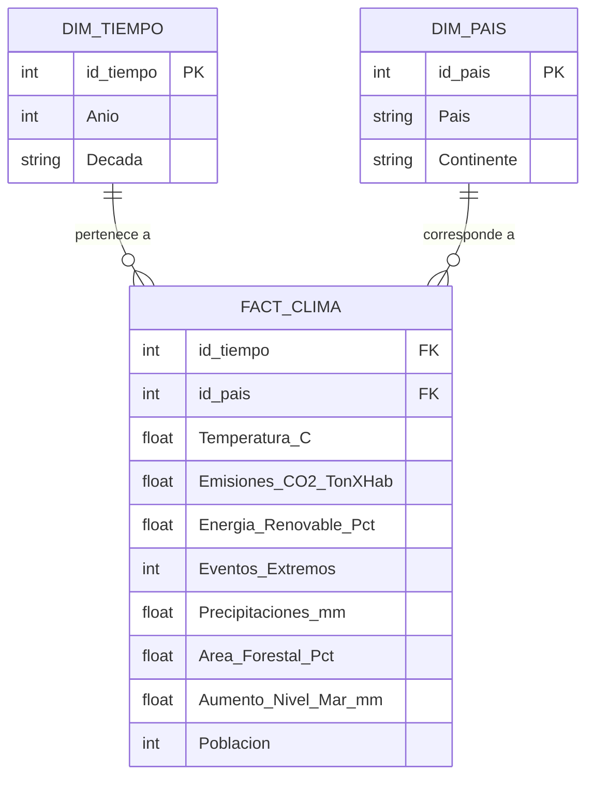

# Proyecto de analítica de datos y modelo predictivo sobre cambio climático

Análisis integral de indicadores climáticos globales (2000–2023) para 15 países, aplicando un flujo ETL → EDA → dashboard de BI → modelo predictivo supervisado.

## Integrantes - Grupo 5

| Nombre | Fase principal | GitHub |
| --- |----------------| --- |
| Ziuvar Ruiz | Fases 1 y 2    | `@ziuvar` |
| Vanessa Alfaro | Fase 3         | `@valexq` |
| Juan Manuel Valencia | Fase 4 y 5     | `@Juanchos2905` |
| Juan Cardona | Fase 4 y 5  | `@jcardser` |

---

# Descripción del proyecto

El dataset contiene 1.000 registros con variables como temperatura promedio, emisiones de CO₂, nivel del mar, precipitaciones, energía renovable, área forestal y eventos climáticos extremos. A partir de ellos se construyó una solución analítica que cubre limpieza de datos, análisis exploratorio, visualización en dashboard y modelado predictivo.

---

# Objetivos

Desarrollar un proyecto integral aplicado al cambio climático que incorpore ETL, inteligencia de negocios y aprendizaje computacional, con los siguientes entregables:

- Datos limpios y transformados listos para análisis.
- Dashboard interactivo con insights.
- Modelo supervisado evaluado con métricas de desempeño.
- Conclusiones y recomendaciones basadas en evidencia.

---

# Tecnologías utilizadas

| Componente | Tecnología |
|---|---|
| Lenguaje | Python 3.11 |
| Manipulación de datos | pandas, numpy |
| Visualización | matplotlib, seaborn, plotly |
| Machine Learning | scikit-learn |
| Notebooks | Jupyter Notebook |
| Persistencia | CSV, Parquet |
| Testing | pytest |

---

# Arquitectura del proyecto

```text
climate_analytics_project/
│
├── data/
│   ├── raw/              
│            └── climate_change_dataset.csv      # Dataset original
│   ├── cleaned/      
│            └── climate_change_cleaned.csv      # Datos limpios
│   ├── processed/       
│            └── climate_change_model_ready.csv  # Datos transformados
├── notebooks/                                   # Notebooks del análisis
│   ├── 01_data_collection_transformation.ipynb
│   ├── 02_data_understanding.ipynb
│   └── 03_modelado_predictivo.ipynb
├── reports/
│   └── Dashboard proyecto final DA             # Informe final
├── requirements.txt
└── README.md
```

---

# Fase 1 - Recopilación y transformación de datos

En esta primera parte se trabajó con el archivo original del proyecto, `data/raw/climate_change_dataset.csv`. El dataset contiene 1,000 registros de indicadores climáticos para 15 países entre los años 2000 y 2023.

El trabajo se enfocó en dejar una base confiable para el resto del proyecto. Se revisó la estructura inicial del archivo, se normalizaron los nombres de las columnas, se ajustaron los tipos de datos y se validaron aspectos básicos de calidad como valores faltantes, duplicados y rangos esperados.

Como resultado, quedaron datos limpios y datos procesados para que las siguientes fases puedan concentrarse en el análisis, el dashboard y el modelo predictivo sin repetir la preparación inicial.

---

# Fase 2 - Análisis exploratorio de datos (EDA)

En la segunda fase se tomó la base limpia y se realizó una exploración inicial para entender mejor el comportamiento de las variables. Se revisaron estadísticas descriptivas, comparaciones por país, cambios por año y relaciones entre indicadores como temperatura, emisiones de CO2, lluvias, energía renovable y área forestal.

También se generaron visualizaciones para observar distribuciones, tendencias y correlaciones. Esta parte sirve como puente entre la limpieza de datos y las fases posteriores de inteligencia de negocios y aprendizaje computacional, porque permite identificar patrones generales antes de construir dashboards o modelos.

# Fase 3 — Inteligencia de negocios: modelo de datos

## Modelo dimensional — Esquema Estrella



## Descripción del modelo

El modelo sigue un **esquema estrella** con una tabla de hechos central rodeada de dos dimensiones. Solo se incluyen las dimensiones que tienen uso real en el dashboard: tiempo para analizar tendencias y país para comparar entre geografías.

### Tabla de hechos — `FACT_CLIMA`
Contiene todas las métricas numéricas por combinación país-año. Es la tabla principal con 1.000 registros (15 países × 24 años).

### Dimensiones

| Dimensión | Rol analítico |
|-----------|-------------|
| `DIM_TIEMPO` | Permite analizar tendencias por año y comparar décadas (2000s, 2010s, 2020s) |
| `DIM_PAIS` | Permite filtrar y agrupar métricas por país y por continente |

### Reglas de negocio

| Regla | Descripción |
|-------|-------------|
| RN-01 | Cada registro representa un país-año único |
| RN-02 | La temperatura se mide en °C con dos decimales |
| RN-03 | Las emisiones de CO₂ son toneladas per cápita |
| RN-04 | La energía renovable y el área forestal son porcentajes (0–100) |
| RN-05 | Los eventos extremos son conteo entero anual por país |
| RN-06 | El período de análisis es 2000–2023 (24 años, 15 países) |
| RN-07 | El CO₂ per cápita es la métrica principal de presión ambiental por país |

---

## Insights del dashboard

Los siguientes hallazgos fueron extraídos directamente de los indicadores y visualizaciones del dashboard de Power BI construido sobre el dataset limpio.

### Insight 1 — Temperatura en alza sostenida
La temperatura promedio global del grupo analizado es de **21,11 °C**, superando en **+2,15 °C** el valor base registrado en el año 2000 (18,96 °C). La línea de tendencia del período 2000–2023 confirma un incremento aproximado de **0,05 °C por año**, coherente con los patrones globales de calentamiento documentados por la IPCC.

### Insight 2 — UK encabeza las emisiones per cápita
Con el mayor promedio de CO₂ por habitante entre los 15 países analizados, **UK lidera el ranking de presión ambiental**, seguido de Indonesia y Francia. Esto indica que los países europeos industrializados mantienen una huella de carbono per cápita mayor que economías emergentes como India o Brasil, a pesar de sus compromisos climáticos formales.

### Insight 3 — Energía renovable lejos de la meta 2030
El promedio global de energía renovable del grupo es de **26,75%**, menos de la mitad de la meta establecida por la Agencia Internacional de Energía para 2030 (60%). China, Brasil y Francia lideran en adopción de renovables, mientras que USA, Australia y South Africa presentan los valores más bajos, lo que correlaciona directamente con sus altas emisiones de CO₂.

### Insight 4 — Las emisiones de CO₂ no han bajado
La evolución del CO₂ por año muestra que las emisiones no han disminuido de forma sostenida en el período analizado. A pesar de las fluctuaciones año a año, la tendencia general entre 2000 y 2023 es **ligeramente ascendente**, lo que indica que los compromisos de reducción no se han traducido en resultados medibles para este grupo de países.

### Insight 5 — Relación inversa entre CO₂ y energía renovable
Los países con mayores emisiones de CO₂ per cápita son sistemáticamente los que menor porcentaje de energía renovable utilizan. Esta correlación negativa confirma que **la transición energética es la palanca más directa para reducir emisiones** y constituye el hallazgo más relevante del análisis para apoyar decisiones de política ambiental.

---

## Preguntas de negocio que responde el dashboard

| Pregunta | Visual que responde |
|---|---|
| ¿Cómo evoluciona la temperatura global? | Gráfico de líneas — Temperatura por año |
| ¿Qué países presentan mayor presión ambiental? | Barras horizontales — CO₂ por país |
| ¿Han bajado las emisiones con el tiempo? | Gráfico de líneas — CO₂ por año |
| ¿Qué tan lejos estamos de la meta renovable? | KPI — Energía renovable vs meta 60% |
| ¿Qué países lideran en energía renovable? | Barras verticales — Renovable por país |

