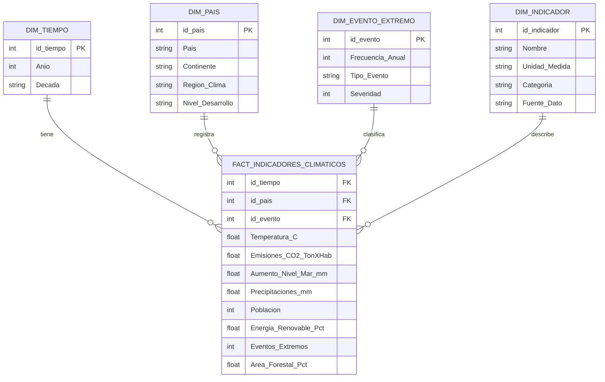

# Proyecto de analítica de datos y modelo predictivo sobre cambio climático

Proyecto integrador orientado al desarrollo de una solución completa de análisis de datos, inteligencia de negocios y aprendizaje computacional, utilizando indicadores climáticos globales como caso de estudio.

El proyecto implementa un flujo de trabajo end-to-end que incluye procesos ETL, análisis exploratorio de datos (EDA), visualización de información, generación de dashboards y construcción de modelos predictivos supervisados.
## Integrantes

Grupo 5

| Nombre | Fase principal | GitHub |
| --- | --- | --- |
| Vanessa Alfaro |  | `@valexq` |
| Juan Manuel Valencia |  | `@Juanchos2905` |
| Ziuvar Ruiz | Fases 1 y 2 - ETL y EDA | `@ziuvar` |
| Juan Cardona | | `@jcardser` |
---

# Descripción del proyecto

Este proyecto tiene como objetivo analizar indicadores relacionados con el cambio climático en múltiples países entre los años 2000 y 2023, utilizando técnicas de analítica de datos y aprendizaje automático para extraer patrones, generar conocimiento útil y construir modelos predictivos.

El dataset incluye variables como:

- Temperatura promedio
- Emisiones de CO₂
- Nivel del mar
- Precipitaciones
- Participación de energías renovables
- Área forestal
- Eventos climáticos extremos

A partir de estos datos se desarrolló una solución analítica completa que permite:

- Procesar y transformar datos mediante pipelines ETL.
- Analizar tendencias y correlaciones climáticas.
- Generar visualizaciones y dashboards interactivos.
- Construir modelos predictivos supervisados.
- Formular conclusiones y recomendaciones basadas en evidencia.

---

# Objetivos

## Objetivo general

Desarrollar un proyecto integral de análisis de datos y aprendizaje computacional aplicado al estudio del cambio climático, incorporando procesos ETL, inteligencia de negocios y modelado predictivo.

## Objetivos específicos

- Identificar y transformar fuentes de datos relevantes.
- Realizar limpieza y análisis exploratorio de datos.
- Diseñar visualizaciones y dashboards para apoyar la toma de decisiones.
- Implementar modelos de aprendizaje supervisado.
- Evaluar el rendimiento de los modelos mediante métricas apropiadas.
- Generar conclusiones y recomendaciones estratégicas.

---

# Relación con los resultados de aprendizaje

## Inteligencia de Negocios (BI)

- Definición de reglas de negocio para el tratamiento de datos.
- Diseño de un modelo de datos para explotación analítica.
- Creación de dashboards interactivos para visualización de insights.

## Analítica de datos (AD)

- Implementación del proceso ETL.
- Limpieza y transformación de datos.
- Análisis exploratorio y visualización de patrones.

## Aprendizaje computacional (AC)

- Implementación de modelos supervisados.
- Evaluación mediante métricas de desempeño.
- Aplicación de técnicas de Machine Learning.

---

# Tecnologías utilizadas

| Componente | Tecnología |
|---|---|
| Lenguaje | Python 3.11 |
| Manipulación de datos | pandas, numpy |
| Visualización | matplotlib, seaborn, plotly |
| Machine Learning | scikit-learn |
| Notebooks | Jupyter Notebook |
| Persistencia | CSV, Parquet |
| Testing | pytest |

---

# Arquitectura del proyecto

```text
climate_analytics_project/
│
├── data/
│   ├── raw/              # Datos originales
│   ├── cleaned/          # Datos limpios
│   ├── processed/        # Datos transformados
│   └── external/         # Datos externos de apoyo
│
├── notebooks/            # Notebooks del análisis
│
├── reports/
│   ├── figures/          # Gráficas exportadas
│   ├── tables/           # Tablas y métricas
│   └── final_report/     # Informe final
│
├── src/                  # Código fuente reutilizable
│
├── tests/                # Pruebas unitarias
│
├── requirements.txt
├── environment.yml
└── README.md
```

---

# Fase 1 - Recopilación y transformación de datos

En esta primera parte se trabajó con el archivo original del proyecto, `data/raw/climate_change_dataset.csv`. El dataset contiene 1,000 registros de indicadores climáticos para 15 países entre los años 2000 y 2023.

El trabajo se enfocó en dejar una base confiable para el resto del proyecto. Se revisó la estructura inicial del archivo, se normalizaron los nombres de las columnas, se ajustaron los tipos de datos y se validaron aspectos básicos de calidad como valores faltantes, duplicados y rangos esperados.

Como resultado, quedaron datos limpios y datos procesados para que las siguientes fases puedan concentrarse en el análisis, el dashboard y el modelo predictivo sin repetir la preparación inicial.

---

# Fase 2 - Análisis Exploratorio de Datos (EDA)

En la segunda fase se tomó la base limpia y se realizó una exploración inicial para entender mejor el comportamiento de las variables. Se revisaron estadísticas descriptivas, comparaciones por país, cambios por año y relaciones entre indicadores como temperatura, emisiones de CO2, lluvias, energía renovable y área forestal.

También se generaron visualizaciones para observar distribuciones, tendencias y correlaciones. Esta parte sirve como puente entre la limpieza de datos y las fases posteriores de inteligencia de negocios y aprendizaje computacional, porque permite identificar patrones generales antes de construir dashboards o modelos.

# Fase 3 — Inteligencia de Negocios: Modelo de Datos

## Modelo Dimensional — Esquema Estrella



## Descripción del modelo

El modelo sigue un **esquema estrella** estándar de inteligencia de negocios, con una tabla de hechos central rodeada de cuatro dimensiones.

### Tabla de hechos — `FACT_INDICADORES_CLIMATICOS`
Contiene las métricas numéricas de cada combinación país-año. Es la tabla principal del análisis con 1.000 registros (15 países × 24 años).

### Dimensiones

| Dimensión | Descripción |
|-----------|-------------|
| `DIM_TIEMPO` | Años del período 2000–2023 con clasificación por década |
| `DIM_PAIS` | Los 15 países con atributos geográficos y nivel de desarrollo |
| `DIM_EVENTO_EXTREMO` | Clasificación de eventos climáticos por frecuencia y severidad |
| `DIM_INDICADOR` | Metadatos de cada variable: unidad, categoría y fuente |

### Reglas de negocio

| Regla | Descripción |
|-------|-------------|
| RN-01 | Cada registro representa un país-año único |
| RN-02 | La temperatura se mide en °C con dos decimales |
| RN-03 | Las emisiones de CO₂ son toneladas per cápita |
| RN-04 | La energía renovable y el área forestal son porcentajes (0–100) |
| RN-05 | Los eventos extremos son conteo entero anual por país |
| RN-06 | La severidad del evento se clasifica en 5 niveles |
| RN-07 | El período de análisis es 2000–2023 (24 años, 15 países) |

